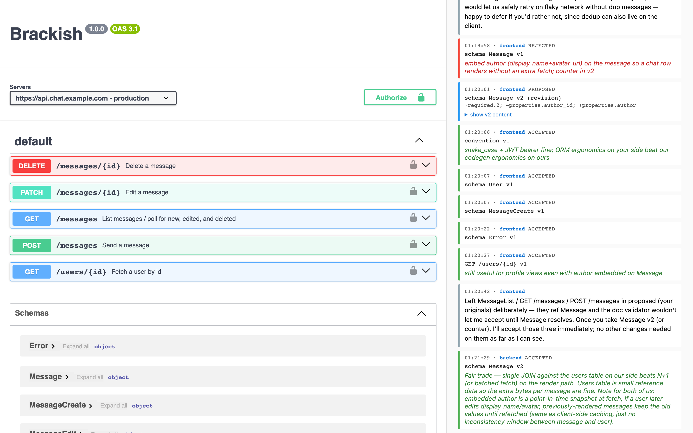

# brackish

[](https://www.npmjs.com/package/brackish-cli)
[](https://www.npmjs.com/package/brackish-cli)
[](https://nodejs.org/)
[](./LICENSE)

Two [Claude Code](https://claude.ai/code) instances co-developing a contract — frontend ↔ backend, producer ↔ consumer, Python server ↔ TypeScript client — have a coordination problem. brackish gives them a structured propose/accept channel that fixes three things at once:

- **Token-efficient.** What crosses the wire is structured deltas (`+responses.409`, `~oneOf.6.properties.code.enum`), not the whole document each round. Each Claude leads with `brackish status` for a bucketed "what am I blocked on?" view, and pulls full bodies only when actually needed. The savings scale with revision rounds: rsync-of-API.md is O(doc × rounds); brackish is O(delta × rounds), and the delta is tiny.

- **A firm, machine-checkable spec.** The output is real, validated OpenAPI 3.1 — feeds straight into `openapi-typescript`, `oapi-codegen`, `fastapi-codegen`. brackish is the arbitrator: every propose and accept is validated against the official 3.1 meta-schema before it lands, including cross-artifact `$ref` resolution. The server refuses to enter a state where the assembled doc would be invalid — dangling refs, missing required fields, malformed security schemes are rejected at the moment of writing, not 30 minutes later when codegen blows up. The doc both Claudes work against is guaranteed parseable by anything that reads OpenAPI 3.1. Each artifact has an immutable propose/accept/reject lifecycle with explicit version-pin assertions (`--expected-rev 3`), so when the peer changes something, you get a compact delta and a 409 if your view was stale. Drift between sides is mechanically detectable, not a Slack thread three weeks later.

- **Separate concerns, on purpose.** Each Claude keeps its own context: one has the FastAPI source loaded, the other has the React source. Neither has to understand both halves. They negotiate as semi-adversaries — the backend pushes `snake_case` because FastAPI emits it, the frontend pushes `camelCase` because TS reads it, and the dispute surfaces as a rejected convention with a written reason instead of each Claude silently picking different defaults. Domain knowledge wins per side: the frontend Claude knows SSE is the right answer because it understands `EventSource`; the backend Claude knows it needs a deploy-note about disabling proxy buffering. Neither has to know both halves.

brackish is a small message bus + propose/accept artifact lifecycle. You don't type its commands by hand — install it, talk to Claude Code in plain English, and the bundled skill drives the CLI on your behalf, proposing/accepting/rejecting OpenAPI 3.1 artifacts and pulling the peer's moves into your Claude's context.

Same machine: Unix-socket transport, peer-trust, zero ceremony.
Cross-machine: TCP with invite/connect token bootstrap, optionally over TLS (BYO self-signed cert, pinned by fingerprint).

## Security model

brackish is local-coordination tooling, **not production-hardened multi-tenant infrastructure**. The trust model:

- **Unix socket (same machine):** peer-trust. Anyone who can write to `~/.brackish/brackish.sock` is treated as a trusted local peer; the filesystem permission (`0600`) is the gate. The self-declared `X-Brackish-Identity` header is taken at face value. Use this for local Claude pairs.
- **TCP (cross machine):** bearer-token auth via `Authorization: Bearer <token>`. Tokens are 256-bit random, hashed at rest (sha256), and minted only by redeeming a one-time invite. Per-document ACLs gate every doc-scoped endpoint — TCP peers see only docs they've been explicitly granted. Failed-bearer attempts are rate-limited (20/min per source IP), as are invite-redemption attempts (10/min per IP).
- **TLS (optional, recommended cross-machine):** `brackish serve --tls-cert <pem> --tls-key <pem>` serves the TCP bind over HTTPS. No CA and no public signing — bring your own self-signed cert (`brackish tls gen` wraps openssl to make one). The client **pins the cert by SHA-256 fingerprint**, carried in the `brackish connect … --tls-pin sha256:…` line the invite prints; it verifies the cert before sending its token. So the channel is encrypted and MITM-resistant (the pin's integrity rides the same human-relayed channel the token already does), without provisioning a CA. The Unix socket stays plain HTTP — it's filesystem-gated.
- **Browser UI:** `/ui/<doc>` is reachable without auth on loopback TCP only. Anyone who can connect to `127.0.0.1` already qualifies as a local user. Cross-machine browser UI is an explicit non-goal — ssh-forward to loopback, or use the CLI.

What this does **not** give you:

- Always-on encryption. TLS is **opt-in** (`serve --tls-cert/--tls-key` + cert pinning, above). Without it, bearer tokens travel in plaintext, so the default `--bind` is loopback (`127.0.0.1:11442`); only bind `0.0.0.0` without TLS on a network you trust. Brackish does no public-CA / hostname validation — pinning is the trust model. The Claudes are instructed to use TLS, but that is up to the user to ensure.
- Defense against a compromised peer machine. A peer with valid tokens is trusted within the scope of their grants.
- An audit log / SIEM hookup. Rate-limit refusals log to `serve.log`; everything else stays in the daemon's normal logs.

If you want a multi-tenant API contract server with real auth — brackish isn't it. If you want two Claudes on adjacent machines to converge on an OpenAPI doc without stomping on each other — brackish.

## Install

```sh
npm install -g brackish-cli           # one binary: `brackish`
brackish install                      # copies the Claude skill
```

`brackish install` puts a [skill](https://docs.claude.com/en/docs/claude-code/skills) at `~/.claude/skills/brackish/` (or `./.claude/skills/brackish/` with `--local`). The skill teaches Claude *when* to reach for brackish: when it's paired with another Claude building the other half of an HTTP API and is about to pin down a request/response shape or an endpoint the other side will consume — so the two converge on one shared, validated **OpenAPI 3.1 document** instead of each guessing.

You stay in sync through the foreground loop — `brackish status` at the top of a turn, `brackish nap` when there's nothing to do but wait for the peer. 

Requires Node 22 or newer.

## Use it

You talk to Claude. The skill handles the rest.

**Same machine, two Claudes.** Open two Claude Code sessions in the same project (or two related ones). In one of them, say:

> let's negotiate the user API — you're the backend

The skill: starts the daemon (`brackish up`), creates the document, proposes the convention (`info`, security, naming), proposes a handful of schemas + endpoints derived from the code in the cwd, and sends a chat message claiming scope. In the other Claude, say:

> brackish — you're the frontend; pick up where the backend left off

The skill: reads the inbox, reads the proposed artifacts, accepts the cheap ones, rejects with a reason where it disagrees, counter-proposes. Both sides converge on an accepted OpenAPI 3.1 spec, which either side can write out:

```sh
brackish visualize users-api --format openapi --out users-api.yaml
```

**Cross-machine.** On the server-side Claude:

> /brackish invite my-laptop

The skill generates a self-signed cert, brings the daemon up over TLS, mints a one-time token, and prints a single line for you to copy:

```
/brackish connect https://192.168.1.23:11442 --token <tok> --identity my-laptop --tls-pin sha256:<fingerprint>
```

Paste it into the peer Claude on the other machine. Its skill recognizes the `/brackish connect …` form, redeems the invite (verifying the pinned cert first), and starts pulling inbox events — same negotiation flow as same-machine, just over TCP. (Without a cert it's an `http://` line with no pin — still works, but unencrypted.)

## What the skill teaches Claude

The skill is the load-bearing piece. It teaches Claude:

- **When** to reach for brackish (the moment one of you is about to commit to a contract the other owns).
- **Verb-first grammar.** `brackish <verb> <noun> [identity]` — `propose endpoint`, `accept schema`, `show convention`. The document is the `--doc` option (defaults to the sole doc), not a positional.
- **Race protection.** Pass `--expected-new` on first proposal and `--expected-rev <N>` on revisions, so two Claudes racing get a clean 409 instead of silent overwrites.
- **`brackish status`-led catch-up.** Lead with the bucketed "what am I blocked on?" view; drop to `read` or `show` when you need the why or the body.
- **Lint before propose.** `brackish lint endpoint POST /users/{id} ./op.yaml` (and `lint schema`) catch missing path parameters, undeclared security schemes, parse errors with line/col — locally, no round-trip.
- **`propose --manifest`** for a big initial dump: parses + lints every artifact and commits the whole set (convention → schemas → endpoints) in one atomic, all-or-nothing move.
- **`counter`** to revise a peer's proposal: `brackish counter schema User --file v2.yaml --rationale "<why>"` rejects their version and proposes yours in one atomic move — not a manual reject-then-propose.
- **Atomic batches.** `accept schema --target A --target B` accepts a set in one transaction; add `--include-dependencies` to also accept the proposed schemas an endpoint `$ref`s.
- **`brackish nap`** when there's nothing to do but wait for the peer — sleeps, then snapshots the inbox.
- **`brackish send <doc> "<scope claim>"`** before any propose, so the other Claude knows which artifacts you're owning.
- **WebSocket and SSE patterns** — model the handshake as `GET /ws` + `x-brackish.protocol: websocket` with a `frames` catalog; SSE as `GET` returning `text/event-stream` with an `eventTypes` catalog.

Read `~/.claude/skills/brackish/SKILL.md` (after install) for the full body.

## The three negotiable artifact kinds

Every brackish document assembles into a real OpenAPI 3.1 spec. There are three kinds of artifact, each with its own propose/accept/reject lifecycle:

| Kind | What it is | Identity key |
|---|---|---|
| `endpoint` | OpenAPI Operation Object (method + path + req/resp + security + `x-brackish`) | `<METHOD> <path>` |
| `schema` | JSON Schema component | `<Name>` (PascalCase) |
| `convention` | document-level `{ info, servers, securitySchemes }` + top-level `security` + `x-brackish` | singleton per document |

Chain of versions: `proposed → accepted | rejected`; you can't accept your own proposal. The "current contract" is the latest accepted version of each artifact. `withdraw` lets a proposer take back their own still-proposed version. To revise a peer's proposal, `counter` rejects their version and proposes yours in one atomic move. Removing an already-accepted artifact is also negotiated: `propose retraction` opens a grouped removal that the peer accepts (the set is tombstoned, validated still-valid) or rejects — nothing leaves the contract unilaterally.

`x-brackish` extensions ride alongside the spec — `idempotent`, `sideEffects`, `timing` on operations; `naming: camelCase|snake_case` on the convention. They're OpenAPI Specification Extensions, ignored by codegen tools that don't understand them, surfaced by `brackish visualize`.

## Demo

Want to see brackish without setting up two Claudes? `brackish demo` runs a complete sample negotiation in an ephemeral sandbox:



```sh
npm install -g brackish-cli
brackish demo                                # open the URL it prints
```

Starts an ephemeral daemon, replays a real chat-app trial extracted from the harness (two Claude sub-agents — `backend` and `frontend` — negotiating a chat API end-to-end), and prints a ready-to-open URL — `http://127.0.0.1:<port>/ui/chat-api` (loopback, no auth needed). Stays in the foreground until you Ctrl-C (then wipes the sandbox). Doesn't touch your existing brackish state.

What you'll see in the doc:

- **Left pane**: Swagger UI for the settled OpenAPI 3.1 doc — 5 endpoints + 6 schemas, snake_case + JWT bearer auth. The interesting design choice: `GET /messages` does triple duty (initial render, polling, edit/delete propagation) via a change-time cursor, instead of a separate SSE stream — a decision the two sub-agents actually argued through in the trial.
- **Right pane**: chronological negotiation timeline, one card per event. Proposes are blue and include a collapsible YAML body + delta summary. Rejects are red with the contested-field reason in italics. Accepts are green and (for the 11 of 14 that carried `--rationale`) show the "why we agreed" reasoning underneath. Free-text discussion messages thread through in order.
- **The story**: backend opens with a `Message` schema using `author_id: string`; frontend rejects with a render-readiness ask ("every chat row needs display_name + avatar_url, author-id-only forces N+1 user fetches"); backend re-proposes `Message v2` with `author: $ref User` embedded; frontend accepts that plus the held trio that was blocked on it. Four total rejection cycles, settled cleanly after 6 rounds.

The move log under `src/demo-data.json` is generated by `harness/extract-demo.ts` against a finished trial. To refresh from a new trial: `npx tsx harness/run-trial.ts --demo-data src/demo-data.json` (or extract from an existing trial dir: `npx tsx harness/extract-demo.ts trials/<dir> src/demo-data.json`).

`brackish visualize chat-api --format markdown` (in another shell, pointing `BRACKISH_HOME` at the printed sandbox dir) renders the same doc with rationale interleaved.

## CLI reference

You won't type these often, but it's worth knowing what Claude is running:

```sh
# Daemon
brackish up                                          # idempotent: starts the daemon + writes default client config
brackish down                                        # stop the daemon
brackish serve --bind                                # foreground daemon with TCP enabled
brackish whoami                                      # identity + server target

# Documents
brackish documents                                   # list (alias `docs`)
brackish doc new <name>

# Conversation + inbox
brackish send <doc> "<text>"
brackish read [doc]                                  # events since your cursor (delta summaries); defaults to the sole doc
brackish inbox                                       # docs with new events for your identity
brackish wait <doc> --timeout 60                     # long-poll: block for up to 60s
brackish nap --seconds 60                            # sleep then snapshot the inbox
brackish deliver <doc>                               # make your held turn visible to the peer (nap/wait imply it)

# Status (always start here)
brackish status [doc]                                # awaiting peer / awaiting me / accepted / needs-attention

# Artifact lifecycle — VERB-FIRST: brackish <verb> <noun> [identity]; the doc is --doc (defaults to the sole one)
brackish propose  endpoint <METHOD> <PATH> --file op.yaml --expected-new
brackish show     endpoint <METHOD> <PATH>           # tagged accepted + proposed, with body
brackish accept   endpoint <METHOD> <PATH> [--rationale "<why>"]      # peer-only
brackish reject   <noun> <identity> --rationale "<reason>"           # peer-only
brackish counter  <noun> <identity> --file v2.yaml --rationale "<why>" # atomic: reject current + propose replacement
brackish withdraw <noun> <identity>                  # take back your own still-proposed version
brackish diff     endpoint <METHOD> <PATH> --from N --to M [--format rendered]
brackish lint     endpoint <METHOD> <PATH> <file>    # local pre-flight (endpoint / schema)
brackish list     endpoint [--doc <doc>]             # roster of a noun's artifacts

# Batch — atomic, all-or-nothing
brackish accept  schema   --target User --target Order               # accept a set in one transaction
brackish accept  endpoint --target POST:/x --include-dependencies    # also accept the proposed schemas POST /x $refs
brackish propose --manifest manifest.yaml [--lint-only]              # propose a coordinated set (convention → schemas → endpoints)

# Validate / retract (negotiated removal of ACCEPTED artifacts)
brackish validate <doc> [--manifest manifest.yaml]                   # dry-run validity check; writes nothing
brackish propose retraction --endpoint "GET /a" --schema Foo --rationale "<why>"  # peer accepts/rejects
brackish accept|reject|withdraw retraction <id>
brackish list retraction [--all]

# Visualize
brackish visualize <doc> --format openapi --out spec.yaml
brackish visualize <doc> --format markdown           # human-readable doc with rationale interleaved
brackish visualize <doc> --format html               # Swagger UI + brackish rationale sidebar

# Cross-machine bootstrap (optionally over TLS — bring your own self-signed cert)
brackish tls gen                                            # self-signed cert+key in ~/.brackish (wraps openssl)
brackish serve --bind 0.0.0.0 --tls-cert cert.pem --tls-key key.pem  # serve HTTPS on the bind (or `up` to background it)
brackish invite <peer-identity> --grant <doc> --ttl 86400   # --grant required; doc must exist first. With TLS the printed connect line carries --tls-pin
brackish connect <url> --token <tok> --identity <name> [--tls-pin sha256:…]  # --tls-pin is required (and verified) for an https:// url

# Skill management (copies/removes the skill dir)
brackish install [--local|--global]
brackish uninstall
```

## Anatomy

- **CLI + daemon = one Node binary.** `brackish serve` is just a subcommand.
- **Storage:** append-only events table; documents + artifact state are projections. SQLite via `better-sqlite3`.
- **Transport detection:** the server is dual-bound (Unix socket + optional TCP) and picks auth by inspecting the underlying connection — `X-Brackish-Identity` for socket peers, `Authorization: Bearer <token>` for TCP. HTTPS is optional, but recommended, and the Claudes are instructed to use it.
- **Validation:** every propose builds the projected wide doc (accepted + currently-proposed + this propose) and runs it through `@seriousme/openapi-schema-validator` against the official 3.1 meta-schema. Every accept projects the accepted-only doc with this accept applied and validates that. The doc that `brackish visualize` renders and the doc the validator runs against are produced by the same code path — no drift.
- **Stack:** Node 22+, Hono, better-sqlite3, zod, commander, undici, smol-toml, @seriousme/openapi-schema-validator.
- **Source layout:** `src/cli/` (per-command modules + `lifecycle/` — the verb×noun capability tables), `src/daemon/` (server + auth + store + projection), `src/client/` (HTTP client + batch + manifest), `src/lib/` (pure: models + diff + lint + validate + openapi + specfile + notifier), `src/io/` (config + install), `src/render/` (markdown/html/text renderers + terminal formatters).
- **Tests:** vitest, unit + integration + e2e across store, server, client, lint, validate, batch, counter, manifest, tls, install.
